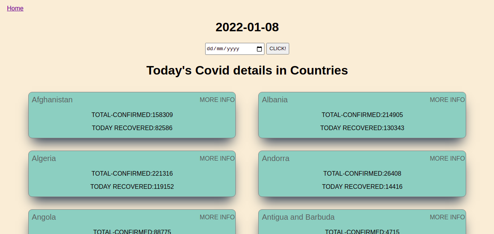

#  Covid app

> This project was built using react redux to fetch 
> covid and country's details from exteranal APIs




## Built With

- React 
- React redux
- React test libraries

## Live Link 
[LINK LIVE](https://coviid.netlify.app/)
[LOOM LINK](https://www.loom.com/share/a5ffa81c46d64a61baa132ecad7dfa99)
## Getting Started

**To get a copy of this repo into your local machine run the following command:**
```
git clone  git@github.com:aakbarkhan/metrics-webapp.git
cd matrices-app
in visual studio code you can click the go live button to view it live in the browser.
```


## Author

👤 **aakbarkhan**

- GitHub: [@aakbarkhan](https://github.com/aakbarkhan)
- LinkedIn: [LinkedIn](https://www.linkedin.com/in/akuu-khan)

## 🤝 Contributing

Contributions, issues, and feature requests are welcome!

Feel free to check the [issues page](../../issues/).

## Acknowledgments

- This project is the Microverse's third module's capstone project
- Thanks to [Nelson Sakwa](https://www.behance.net/sakwadesignstudio) who is author of the original design.

## Show your support

Give a ⭐️ if you like this project!


## 📝 License

This project is [MIT](./MIT.md) licensed.